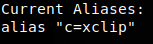
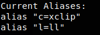
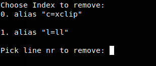

# AliasTracker
Easily add, remove and view currently configured aliases on your linux distribution.

Put the script in your `/usr/local/bin` folder and you're all set.

### To view your current aliases
`aliastracker -v`

### To add to your current aliases
`aliastracker -a "l=ll"`

### To remove from your current aliases
`aliastracker -r`

